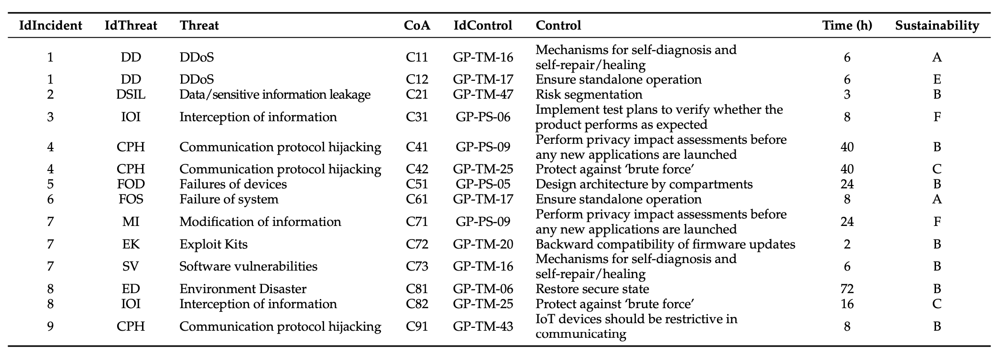
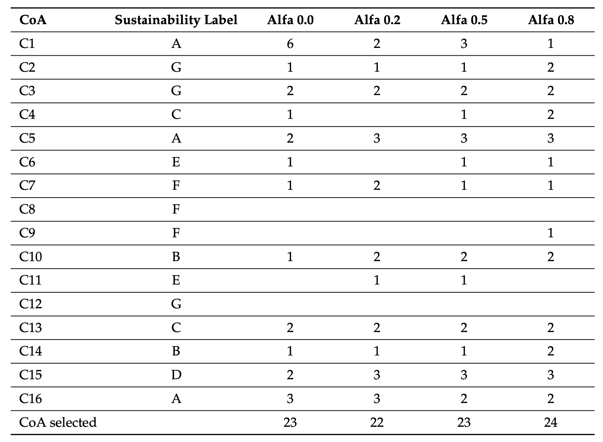
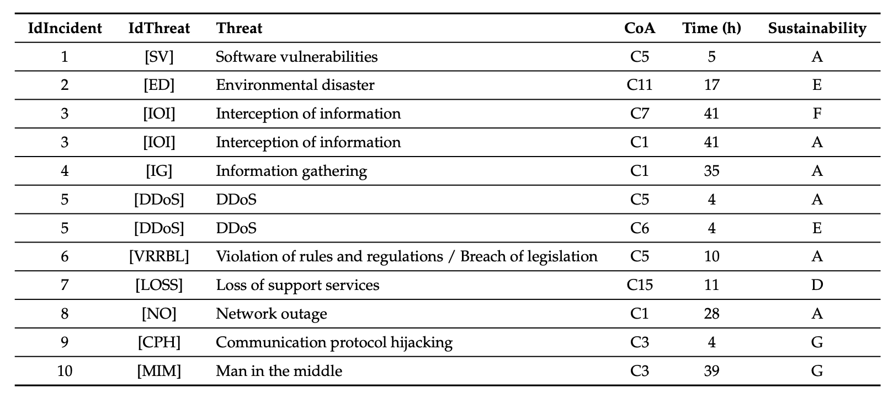

# QISS
## Quantum-Enhanced Sustainable Security Incident Handling in IoT

## Introduction

In the realm of the Internet of Things (IoT), the increased integration of cyber-physical systems across critical sectors has amplified exposure to cybersecurity vulnerabilities. This article introduces a novel approach for security incident management that combines response rapidity with environmental sustainability using quantum computing techniques.

## Development and Main Contributions

The paper introduces MARISMA, a practical framework implementing an Information Security Management System (ISMS) prioritizing response actions both in terms of timing and sustainability. Utilizing a quantum approach, this method allows for rapid and consistent evaluation independent of the incident volume, essential for IoT environments with numerous devices.

**Keywords:** cybersecurity, sustainability, incident response, quantum programming, quantum annealing.

## Methodology and Validation

A quantum algorithm is developed that efficiently selects the minimal set of required actions to cover all detected incidents, considering both response speed and sustainability. Validation is carried out through practical examples demonstrating the applicability and effectiveness of the method in real scenarios.

### Example of Incident Dataset

*It shows the dataset of security incidents used to validate the quantum algorithm. Each row represents a unique incident, detailing the associated threat, the course of action required, and its sustainability rating. This table provides a comprehensive overview of the incidents and the considered responses, highlighting the complexity of managing security in IoT environments.*

## Proposed Quantum Approach and Results

The use of quantum computing is proposed to manage the incidents efficiently, considering both the response time and sustainability aspects. The approach is validated through several examples.

### Quantum Algorithm Performance

*It displays the performance results of the quantum algorithm. It illustrates how different configurations of the algorithm, focusing variably on speed versus sustainability, affect the selection of courses of action. The table is crucial for understanding how the quantum approach adapts to different prioritization needs.*

## Implications and Future Directions

The study emphasizes the importance of integrating sustainability into security incident responses, proposing further research into adapting this approach to other critical sectors reliant on IoT. Additionally, the integration of artificial intelligence techniques to enhance incident prediction and automate responses is discussed.

### Comparison of Results Across Different Scenarios

*It compares the effectiveness of different response strategies across several simulated scenarios. It provides insights into how the application of the quantum algorithm varies with different priorities, such as response time versus sustainability, demonstrating the flexibility and adaptability of the proposed method.*

## How to Use This Repository

This repository contains the code and data used for the application examples of the quantum algorithm for security incident handling in IoT. Detailed instructions for running the code and replicating the results are available in the included documentation files.

